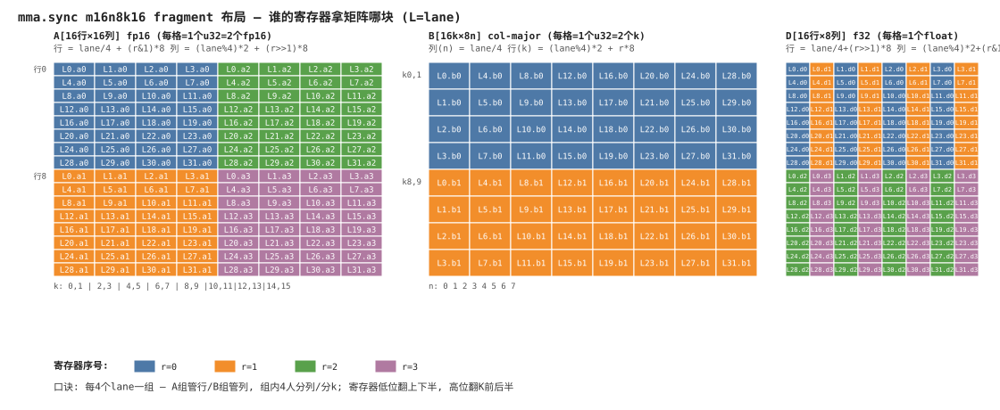
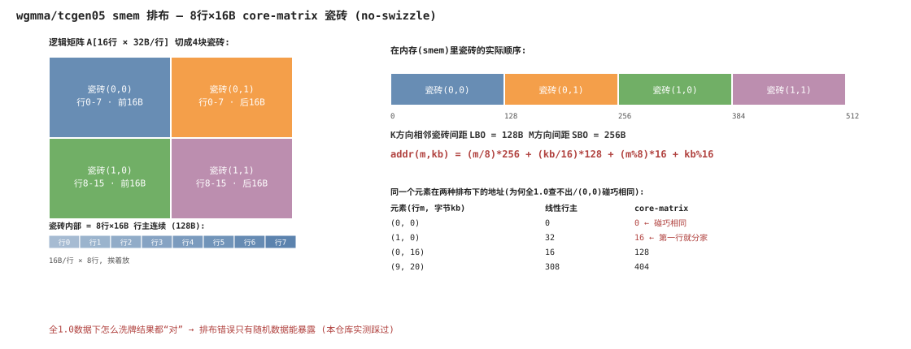
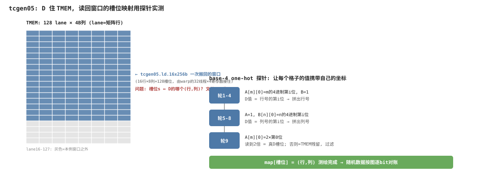

# Tensor Core 数据排布图解

三种硬件路径、三套排布规则。这是本仓库最容易踩坑的部分——排布错了，全 1.0 测试照样"全对"，
随机数据立刻全错（本仓库实测踩过，见 git log 的 fix 记录）。

---

## 1. mma.sync：寄存器 fragment 布局



### 1.1 先记住两个坐标

warp 的 32 个 lane 先按 4 个一组分组：

```
groupID  = lane / 4     ∈ 0..7    ← 8个组
threadID = lane % 4     ∈ 0..3    ← 组内位置
```

**规律一句话：组管行，组内 4 人横着分列；寄存器的低位翻上下半，高位翻 K 前后半。**

### 1.2 A[16×16] fp16 的完整地图（m16n8k16，每 lane 4 个 u32，每 u32 装 2 个 fp16）

```
            k=0,1   k=2,3   k=4,5   k=6,7  │ k=8,9  k=10,11 k=12,13 k=14,15
          ┌───────┬───────┬───────┬───────┬───────┬───────┬───────┬───────┐
   行 0   │ L0.a0 │ L1.a0 │ L2.a0 │ L3.a0 │ L0.a2 │ L1.a2 │ L2.a2 │ L3.a2 │
   行 1   │ L4.a0 │ L5.a0 │ L6.a0 │ L7.a0 │ L4.a2 │ L5.a2 │ L6.a2 │ L7.a2 │
   行 2   │ L8.a0 │ L9.a0 │ L10.a0│ L11.a0│ L8.a2 │  ...  │       │       │
   ...    │  ...  │       │       │       │       │       │       │       │
   行 7   │ L28.a0│ L29.a0│ L30.a0│ L31.a0│ L28.a2│  ...  │       │ L31.a2│
          ├───────┼───────┼───────┼───────┼───────┼───────┼───────┼───────┤
   行 8   │ L0.a1 │ L1.a1 │ L2.a1 │ L3.a1 │ L0.a3 │ L1.a3 │ L2.a3 │ L3.a3 │
   行 9   │ L4.a1 │  ...  │       │       │ L4.a3 │       │       │       │
   ...    │  ...  │       │       │       │       │       │       │       │
   行15   │ L28.a1│ L29.a1│ L30.a1│ L31.a1│ L28.a3│  ...  │       │ L31.a3│
          └───────┴───────┴───────┴───────┴───────┴───────┴───────┴───────┘
            └── 寄存器 a0/a1 管 K 前半 ──┘   └── a2/a3 管 K 后半 ──┘
                a0/a2 管上 8 行, a1/a3 管下 8 行

公式(代码里的 mma_a_idx):
    行 = groupID + (r & 1) * 8          r = 寄存器序号 0..3
    列 = threadID*2 + (r >> 1) * 8      (fp16: 每u32为2列; 其他精度改元素数)
```

### 1.3 B[16(k)×8(n)]（col-major，每 lane 2 个 u32）

```
             n=0     n=1     n=2    ...   n=7        ← 8 列正好 8 个组: 组管列!
          ┌───────┬───────┬───────┬─────┬───────┐
  k=0,1   │ L0.b0 │ L4.b0 │ L8.b0 │ ... │ L28.b0│
  k=2,3   │ L1.b0 │ L5.b0 │  ...  │     │ L29.b0│    组内4人竖着分 K
  k=4,5   │ L2.b0 │ L6.b0 │       │     │ L30.b0│
  k=6,7   │ L3.b0 │ L7.b0 │       │     │ L31.b0│
          ├───────┼───────┼───────┼─────┼───────┤
  k=8,9   │ L0.b1 │ L4.b1 │  ...  │     │ L28.b1│    b1 管 K 后半
  ...     │  ...  │       │       │     │       │
  k=14,15 │ L3.b1 │ L7.b1 │       │     │ L31.b1│
          └───────┴───────┴───────┴─────┴───────┘

公式:  列(n) = groupID;   行(k) = threadID*2 + r*8
```

### 1.4 D[16×8] f32（每 lane 4 个 float）

```
             n=0     n=1     n=2     n=3     n=4     n=5     n=6     n=7
          ┌───────┬───────┬───────┬───────┬───────┬───────┬───────┬───────┐
   行 0   │ L0.d0 │ L0.d1 │ L1.d0 │ L1.d1 │ L2.d0 │ L2.d1 │ L3.d0 │ L3.d1 │
   行 1   │ L4.d0 │ L4.d1 │ L5.d0 │  ...  │       │       │       │       │
   ...    │  ...  │       │       │       │       │       │       │       │
   行 7   │ L28.d0│ L28.d1│  ...  │       │       │       │       │ L31.d1│
          ├───────┼───────┼───────┼───────┼───────┼───────┼───────┼───────┤
   行 8   │ L0.d2 │ L0.d3 │ L1.d2 │  ...  │       │       │       │       │
   ...    │  ...  │       │       │       │       │       │       │       │
   行15   │ L28.d2│ L28.d3│  ...  │       │       │       │       │ L31.d3│
          └───────┴───────┴───────┴───────┴───────┴───────┴───────┴───────┘

公式(代码里的 mma_d_idx):  行 = groupID + (r>>1)*8;   列 = threadID*2 + (r&1)
```

**为什么长这样**：lane L 手里的 A 行片段 × 它自己的 B 列片段，正好贡献给它自己的 D 格子
——乘加过程零跨线程通信，这是 fragment 布局的设计目的。

其他形状（k8/k32/k64）同一套骨架，只是每个 u32 装的元素数变了（tf32×1、fp8×4、fp4×8）。

---

## 2. wgmma / tcgen05：smem 的 core-matrix 瓷砖排布



### 2.1 错误直觉 vs 硬件现实

A[16行 × 32字节/行]，你以为往 smem 里这样放（线性行主）：

```
  字节地址:  0        32       64       96      128 ...
            │ 行0    │ 行1    │ 行2    │ 行3    │ 行4 ...
```

硬件（按 descriptor）实际这样读——**8行×16字节 的瓷砖（core matrix）**：

```
  把矩阵切瓷砖:                     瓷砖在内存里的顺序:
       kb=0..15   kb=16..31
     ┌──────────┬──────────┐        字节    0..127   : 瓷砖(0,0)  ← 行0..7 的前16B
行0-7│ 瓷砖(0,0) │ 瓷砖(0,1) │        字节  128..255   : 瓷砖(0,1)  ← 行0..7 的后16B
     ├──────────┼──────────┤        字节  256..383   : 瓷砖(1,0)  ← 行8..15 的前16B
行8- │ 瓷砖(1,0) │ 瓷砖(1,1) │        字节  384..511   : 瓷砖(1,1)  ← 行8..15 的后16B
  15 └──────────┴──────────┘
                                    瓷砖内部: 8行 × 16B, 行主连续(共128B)

  地址公式:
  addr(m, kb) = (m/8)*SBO + (kb/16)*LBO + (m%8)*16 + (kb%16)
                 ↑M方向瓷砖步长  ↑K方向瓷砖步长   ↑─── 瓷砖内部 ───↑
  实测: LBO = 128B, SBO = 256B   (descriptor 里按 >>4 编码: 8 和 16)
```

### 2.2 对照几个具体地址，感受差异

```
  元素(行m, 字节kb)   线性行主 addr    core-matrix addr
  ─────────────────────────────────────────────────
  (0, 0)                  0                0          ← 相同, 迷惑性来源
  (1, 0)                 32               16          ← 第一行就开始不同!
  (0, 16)                16              128
  (8, 0)                256              256          ← 又碰巧相同
  (9, 20)               308              276+4=?  → (9/8)*256+(20/16)*128+(9%8)*16+4 = 256+128+16+4 = 404
```

**为什么全 1.0 查不出**：排布只是字节的重新洗牌。所有字节都是同一个值时，怎么洗、读哪里，
算出来都一样。随机数据下，硬件从"错的位置"读到的是别的元素，结果立刻不同——这就是本仓库
`vr_to_core_matrix()` 存在的原因（host 侧先洗牌再上卡），也是当年 wgmma 随机测试
512 个只对 10 个的根因。

### 2.3 descriptor 把地图交给硬件

```
  64bit descriptor:
  ┌─────────┬──────────┬──────────┬─────┬─────────┐
  │[0:14)   │ [16:30)  │ [32:46)  │ 46  │ [62:64) │
  │基址>>4  │ LBO>>4=8 │ SBO>>4=16│ ver │ swizzle │
  └─────────┴──────────┴──────────┴─────┴─────────┘
   ver: tcgen05 要求置1, wgmma 不用
   swizzle: 本仓库全用 0(不打散); 真实kernel用SW128等XOR模式避免bank conflict, 瓷砖内部再洗一层
```

---

## 3. tcgen05 的 TMEM：D 的排布用探针实测



### 3.1 TMEM 长什么样

```
  TMEM(每SM 256KB): 128个lane × 若干4B列,  lane ≈ 矩阵行
        列0   列1   列2 ... 列7  │ 列8...31 (分配了但本例没用)
  lane0 │D[0][0]│D[0][1]│ ... │D[0][7]│
  lane1 │D[1][0]│ ...          │      │
  ...   │
  lane127│D[127][0]  ...       │      │
```

### 3.2 读回窗口与"槽位映射"问题

`tcgen05.ld.16x256b.x1` 由一个 warp 执行，搬回 **16行×8列 = 128 个 f32**，
每线程得到 4 个寄存器 = 128 个"槽位"。问题：**槽位 s ↔ D 的哪个 (行,列)？**
文档语焉不详，我们第一版按猜的映射写，随机测试当场揭穿（还发现 TMEM 跨 kernel 有残留）。

### 3.3 解法：base-4 one-hot 探针（不猜，让硬件自己报告）

```
  探针原理: 让 D 的每个格子的"值"携带自己的坐标信息。

  第1轮:  A[m][0] = m的4进制第0位 (0..3, 所有格式都能精确编码)
          B[n][0] = 1
          → D[m][n] = m的第0位  → 每个槽位读到的数 = 它所在行的第0位
  第2~4轮: 第1/2/3位 → 拼出完整行号(4位4进制=0..255, 支持M=256)
  第5~8轮: A/B角色互换 → 拼出列号
  第9轮:  A[m][0] = 2×第0位 → 真D槽位应读到2倍 → 不满足的槽位是TMEM残留, 过滤

  9轮之后: map[槽位s] = (行, 列) 完整测绘, 随机比对按图对号入座。
```

这个思路的普适价值：**当排布文档不可信时，用"值携带坐标"的探针让硬件自己把地图画出来**
——TS 变体（A 在 TMEM，st 布局同样未知）用的是同思路的提取法：随机写入后拿 64 轮
B one-hot 把硬件眼中的 A_eff 整个读出来，再拿它当参考验证 MMA。

---

## 4. 三套排布总表

| 路径 | 操作数 | 排布 | 规则来源 | 仓库对应代码 |
|---|---|---|---|---|
| mma.sync | A/B/D 寄存器 | fragment 公式（组管行/列）| PTX 文档，可信 | `mma_a_idx / mma_b_idx / mma_d_idx` |
| wgmma / tcgen05 | A/B 在 smem | 8×16B core-matrix 瓷砖, LBO=128B/SBO=256B | 文档模糊，**实测钉死** | `vr_to_core_matrix()` + `make_desc*()` |
| tcgen05 | D 在 TMEM | 16×8 读回窗口，槽位映射不可靠 | **探针实测** | `vr_verify()` 的 probe 段 |
