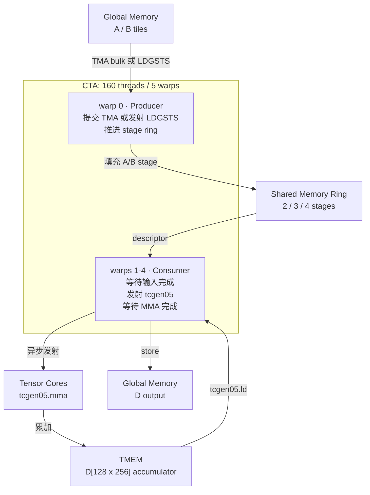
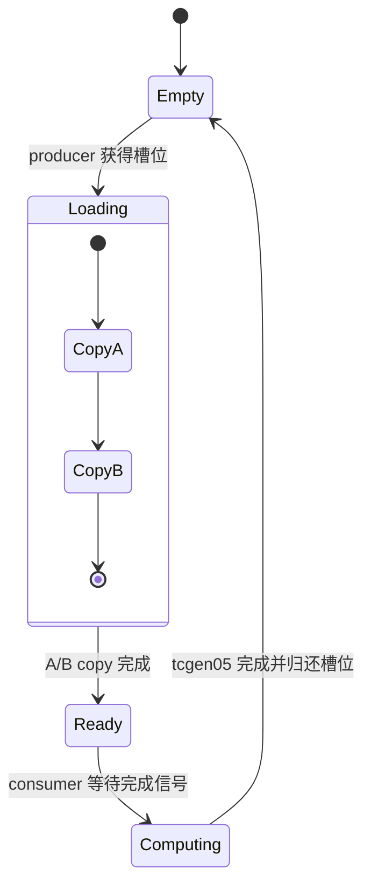
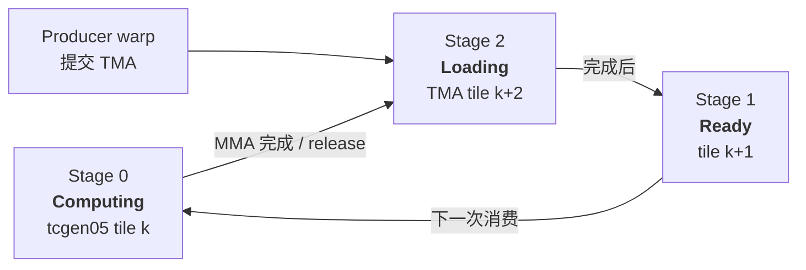
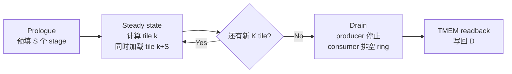

# Blackwell SM100 / SM103 tcgen05 流水

本目录只保留两条可配置多级流水：

| 文件 | 搬运方式 | stage |
|---|---|---|
| `sm100_tcgen05_nvfp4_ldgsts_multistage_pipeline.cu` | `cp.async` / LDGSTS | 2/3/4-stage |
| `sm100_tcgen05_nvfp4_tma_multistage_pipeline.cu` | `cp.async.bulk` TMA + transaction mbarrier | 2/3/4-stage |

精度与 tile：

```text
NVFP4 E2M1 + UE4M3 block scale -> FP32
CTA output tile: M128 x N256
K tile/stage: K64
每 stage: A[128x64] 4 KiB + B[64x256] 8 KiB = 12 KiB
```

编译时选择流水深度和 K tile 数：

```bash
nvcc -gencode arch=compute_100a,code=sm_100a -std=c++17 -O3 \
  -DPIPELINE_STAGES=3 -DPIPELINE_K_ITERS=64 -DPIPELINE_VERBOSE=0 \
  -o t sm100_tcgen05_nvfp4_tma_multistage_pipeline.cu
```

约束：

```cpp
2 <= PIPELINE_STAGES <= 4
PIPELINE_STAGES <= PIPELINE_K_ITERS
K_total = 64 * PIPELINE_K_ITERS
```

## 流水状态

每个 stage 包含 A/B shared-memory buffer。TMA 版本额外使用：

```text
mbar_load[stage]  # A+B TMA transaction 完成
mbar_done[stage]  # tcgen05 完成
EMPTY(stage)      # consumer 归还槽位
```

执行过程：

```text
Prologue:     producer 填充全部 stage
Steady state: consumer 计算旧 stage；producer 重填已归还 stage
Drain:        producer 退出；consumer 排空 ring 中剩余 tile
```


## Pipeline 实现

### CTA 角色



单个 stage 对应一次 `M128 x N256 x K64` 计算：

```text
A stage = A[128, 64] = 4 KiB
B stage = B[64, 256] = 8 KiB
总计                       12 KiB/stage
```

### Stage 生命周期



完成信号：

| 路径 | Loading 完成通知 |
|---|---|
| TMA | `mbar_load[stage]` transaction parity 翻转 |
| LDGSTS | `cp.async.wait_group` 后发布 FULL barrier |

`mbar_done[stage]` 跟踪 `tcgen05` 完成；`EMPTY(stage)` 防止 producer 覆盖仍被 Tensor Core 使用的 shared-memory tile。

### 3-stage 稳态快照



```text
时间 ──────────────────────────────────────────────────────────────>

Producer   load K0/S0  load K1/S1  load K2/S2  load K3/S0  load K4/S1
TensorCore             MMA K0      MMA K1      MMA K2      MMA K3
Stage ring S0 ───────────────> S1 ───────────────> S2 ───────────────> S0
                prologue             steady-state overlap              drain
```

### Prologue / steady state / drain



Stage ring 由以下状态推进：

```cpp
stage = (stage + 1) % PIPELINE_STAGES;
tile++;
```

- **Prologue**：前 `S` 个 tile 不等待 EMPTY，填满 ring。
- **Steady state**：一个 stage 在计算，一个可 ready，另一个可加载。
- **Drain**：最后一笔搬运后 producer 退出，consumer 排空剩余 stage。

更多 stage 只增加“提前准备”的 tile 数，不增加 Tensor Core 数量；足以隐藏搬运延迟后，继续加 stage 只增加 shared-memory 成本。

## 正确性

B100/SM100 真机上，TMA 2/3/4-stage 均通过：

```text
D布局探针: 128/128 槽位一致有效
random r0 PASS (128/128 exact)
random r1 PASS (128/128 exact)
random r2 PASS (128/128 exact)
```

验证覆盖 TMA、stage 环形复用、mbarrier parity、tcgen05 累加和 TMEM 读回，并与 CPU reference 逐 bit 比较。

## 锁频性能结果

测试条件：

```text
GPU: GB200 / SM100
SM clock: 1965 MHz locked
CUDA: 13.4 internal engineering build
CTA/grid: 单 CTA，单 M128xN256 输出 tile
Warmup: 50
Measured launches: 500
Timing: CUDA events
Device printf: PIPELINE_VERBOSE=0
```

延迟单位为微秒：

| K_total | LDGSTS S2 | LDGSTS S3 | LDGSTS S4 | TMA S2 | TMA S3 | TMA S4 |
|---:|---:|---:|---:|---:|---:|---:|
| 512  | 6.449 | 6.438 | 6.432 | 5.271 | 5.065 | **5.020** |
| 1024 | 10.166 | 10.150 | 10.138 | 7.694 | 7.208 | **7.161** |
| 2048 | **21.060** | 22.268 | 21.072 | 12.520 | 11.455 | **11.426** |
| 4096 | **39.267** | 41.608 | 39.350 | 22.046 | 19.874 | **19.862** |

K=4096 等效单 CTA 吞吐：

| 路径 | TFLOP/s |
|---|---:|
| LDGSTS S2 | 6.836 |
| LDGSTS S3 | 6.452 |
| LDGSTS S4 | 6.822 |
| TMA S2 | 12.176 |
| TMA S3 | 13.507 |
| TMA S4 | 13.515 |

## 结论

- K=4096 时，TMA S3 相比 LDGSTS S2 加速约 **1.98x**。
- TMA S3 相比 TMA S2 加速约 **10.9%**：第三个 stage 提供一个 ready tile，进一步隐藏 TMA latency。
- TMA S4 相比 S3 仅约 **0.06%**，没有实际收益，却多占约 12 KiB shared memory。
- LDGSTS 增加 stage 没有稳定收益。producer warp 仍需为每个 16B copy 反复发射指令，更多 buffer 不能消除发射开销。
- 对当前 `M128xN256xK64/stage` 形状，推荐 **TMA 3-stage**。

这些数据衡量单 CTA mainloop 延迟，不代表整卡 GEMM 峰值吞吐。
