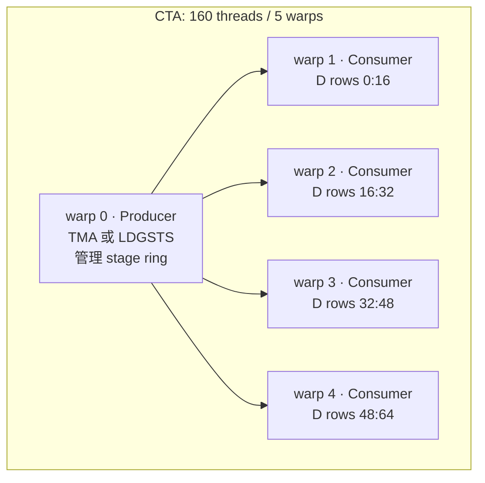
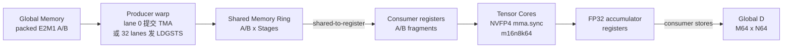
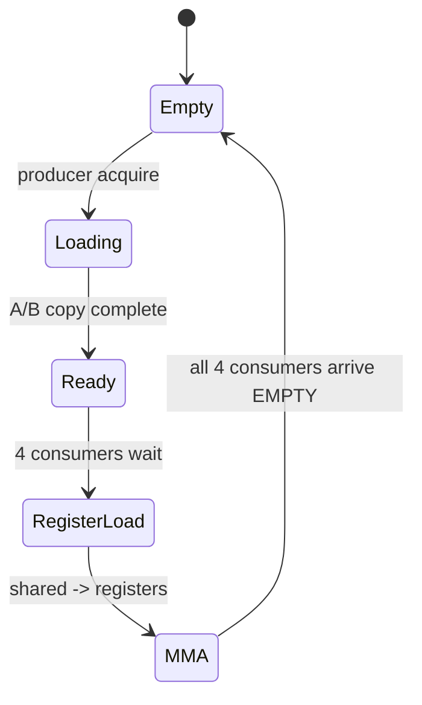
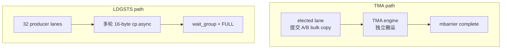
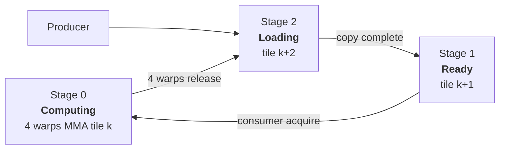
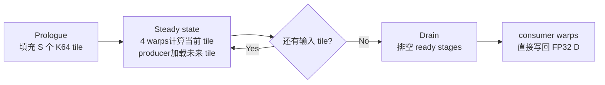

# SM120 NVFP4 warp-specialized pipeline

本目录只保留两个多级流水文件：

- `sm120_mma_sync_nvfp4_ldgsts_multistage_pipeline.cu`
- `sm120_mma_sync_nvfp4_tma_multistage_pipeline.cu`

共同配置：

```text
1 producer warp + 4 consumer warps
CTA tile: M64 x N64
K tile/stage: K64
NVFP4 E2M1 + UE4M3 block scale -> FP32
PIPELINE_STAGES: 2/3/4
```

每个 consumer warp 负责 `M16 x N64`，每个 K64 发射 8 条原生 NVFP4 `mma.sync`。


## Pipeline 实现

### CTA 角色与输出分块



每个 consumer warp 负责 `M16 x N64`，每个 K64 发射 8 条原生 NVFP4 `mma.sync`：

```text
warp 1: D[ 0:16, 0:64]
warp 2: D[16:32, 0:64]
warp 3: D[32:48, 0:64]
warp 4: D[48:64, 0:64]
```

### 数据通路



SM120 没有 TMEM，consumer warp 必须保存 accumulator，并完成 shared-to-register fragment load。

### 每个 stage 的数据

```text
A stage = A[64, 64] = 2 KiB
B stage = B[64, 64] = 2 KiB
总计                     4 KiB/stage
```

### Stage 生命周期



TMA 与 LDGSTS 的差异只在 `Loading`：



### 3-stage 稳态快照



```text
时间 ──────────────────────────────────────────────────────────────>

Producer    load K0/S0  load K1/S1  load K2/S2  load K3/S0
Consumers               MMA K0      MMA K1      MMA K2      MMA K3
                          ↑ 4 consumer warps共同覆盖 M64 x N64
```

### Prologue / steady state / drain



stage 数增加时 shared memory 线性增加。足以隐藏搬运延迟后，继续增加 stage 不再提升吞吐，并可能降低真实多 CTA kernel 的 occupancy。

## 锁频性能

测试条件：RTX PRO 6000 Blackwell Server Edition，SM120，SM clock 锁定 2430 MHz，单 CTA，50 次 warmup，500 次 CUDA event 计时。

| K_total | LDGSTS S2 | LDGSTS S3 | LDGSTS S4 | TMA S2 | TMA S3 | TMA S4 |
|---:|---:|---:|---:|---:|---:|---:|
| 512  | 4.364 | 4.345 | 4.268 | 3.023 | 2.774 | **2.654** |
| 1024 | 7.296 | 7.287 | 7.666 | 4.499 | 3.906 | **3.864** |
| 2048 | 13.072 | 13.068 | **12.801** | 7.613 | **6.308** | 6.393 |
| 4096 | 24.417 | **24.375** | 25.851 | 14.619 | 13.467 | **12.286** |

单位：微秒。

K=4096 时：

- TMA S3 相比 LDGSTS S2：`1.81x`。
- TMA S4 相比 LDGSTS S2：`1.99x`。
- TMA S4 相比 TMA S2：约 `19.0%`。
- LDGSTS 增加 stage 没有稳定收益。

当前单 CTA 形状下，TMA 明显降低 producer warp 的搬运指令开销。深 stage 的最优点随 K 有波动：K=2048 是 S3 最快，K=4096 是 S4 最快；实际 kernel 还需结合 shared-memory occupancy 选择。

所有 2/3/4-stage 的 LDGSTS 与 TMA 配置均通过全 1.0 精确结果验证；性能文件后续继续补随机 CPU reference。
